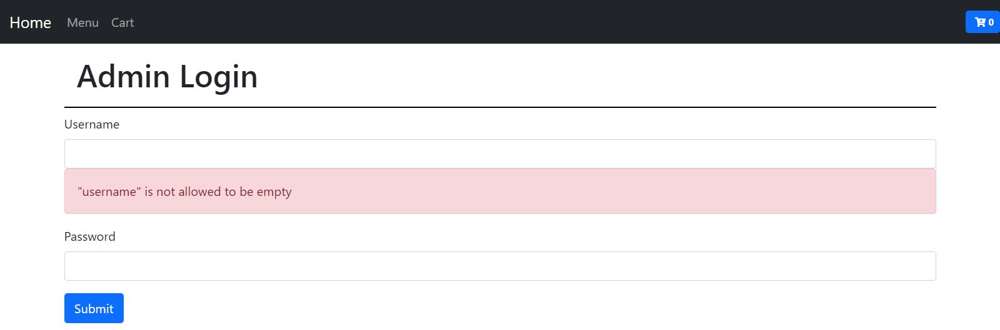
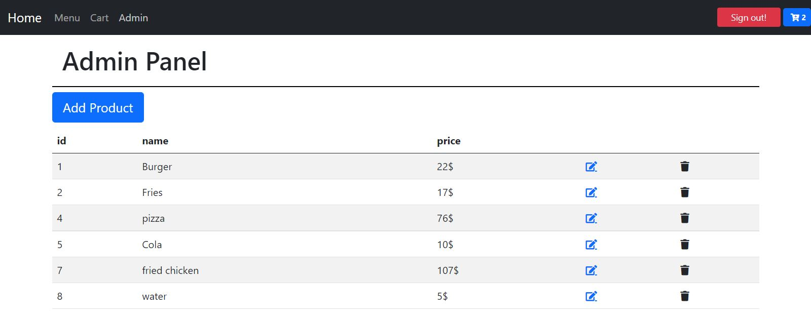

## Food court

#### It is a simple CRUD app with React, you can browse the menu, add food to your cart, choose the quantities, and add/remove food or edit prices if you are logged in as an admin

#### I used:

- React
- React router
- functional components
- bootstrap
- hooks
- axios
- json-server
- joi
- protected routes with login/logout authentication
- sessionStorage

<p align="center">


</p>

## Usage

clone the repo, inside the newly created project, you can run some built-in commands:

### Start JSON Server

```sh
cd online-food-court/DB
json-server --watch db.json
```

### `npm start` or `yarn start`

```sh
cd online-food-court
```

Runs the app in development mode.<br>

The page will automatically reload if you make changes to the code.<br>
You will see the build errors and lint warnings in the console.

### `npm test` or `yarn test`

Runs the test watcher in an interactive mode.<br>
By default, runs tests related to files changed since the last commit.

### `npm run build` or `yarn build`

Builds the app for production to the `build` folder.<br>
It correctly bundles React in production mode and optimizes the build for the best performance.

The build is minified and the filenames include the hashes.<br>

Your app is ready to be deployed.
